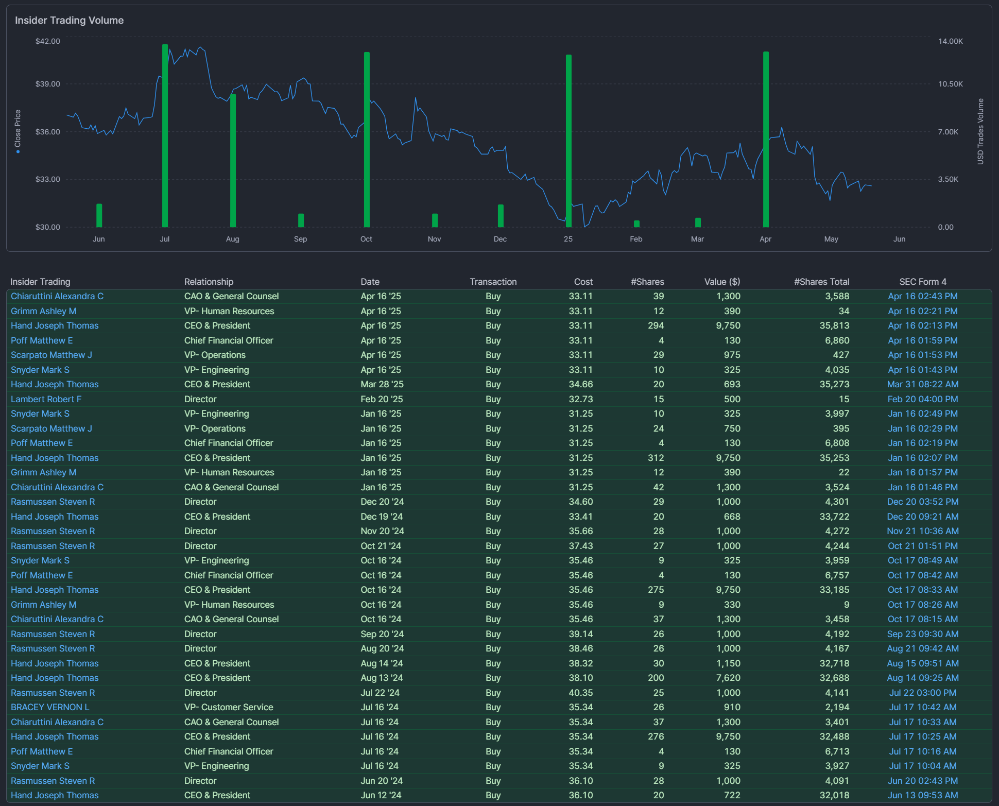
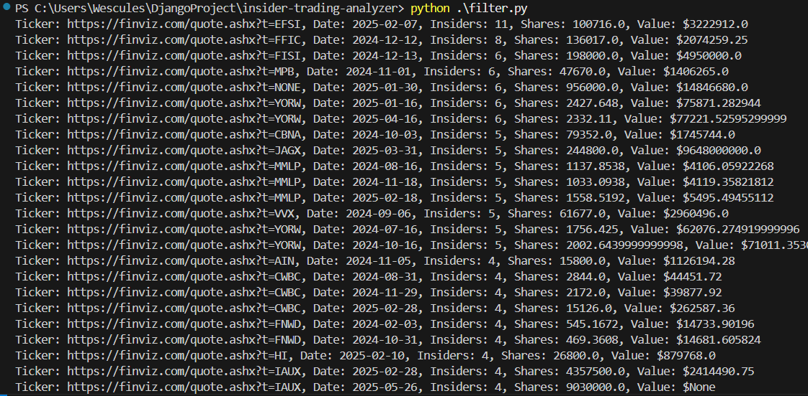

# Insider Screener & Alerts Bot

A Python project that downloads Form 4 and Form 144 SEC filings, filters for high-signal insider trades, cross-references market signals, and supports backtesting.

## Features
- Parses and stores insider filings into DuckDB
- Screens for high-value and cluster insider buys
- Cross-references earnings, news, and short interest
- Backtests historical success of trades

## Getting Started
```bash
pip install -r requirements.txt
python download_filings.py # populate a local database with all filings
python filters.py --min_buy 100000 # search db using filters
python backtest.py --days 30 
```
### Cluster Buys Detected


---

## 🏁 Optional Future Add-ons

* UI dashboard (e.g., Streamlit or Dash)
* Insider heatmap by sector
* Sentiment overlay from social media/news
* Broker API alerts (e.g., Alpaca or IBKR paper trading)


#### **Signal Enrichment & Alerts**

#### ✅ Goal: Cross-reference with other market data sources

* [ ] **Earnings calendar** (e.g., EODHD, Yahoo Finance, or Nasdaq API)
* [ ] **Analyst upgrades/downgrades** (Finviz scrape, MarketBeat, Barchart)
* [ ] **Short interest** (e.g., via FINRA or third-party APIs)
* [ ] **News headlines** (e.g., RSS feeds, Benzinga, or scraping Yahoo News)
* [ ] Flag if insider trade occurred **before earnings, after downgrade, or on high short interest**

#### Deliverables:

* `enrich_signals.py`: joins filing data with enrichment signals
* `alerts.py`: outputs summary alerts to email/Slack/Telegram


####   Backtesting Engine**

#### ✅ Goal: Test predictive power of insider trades

* [ ] Load **historical price data** (Alpha Vantage, Polygon, Yahoo Finance, etc.)
* [ ] Join filing date with price history:

  * Compute **% return after 7, 14, 30, 60 days**
  * Label trades as “successful” if return > threshold
* [ ] Support backtest filters:

  ```bash
  python backtest.py --filter "officer_buys > 100000 AND cluster = True"
  ```

#### Deliverables:

* `backtest.py`: returns distribution of returns per filter
* Summary report: hit rate, average return, drawdown

---